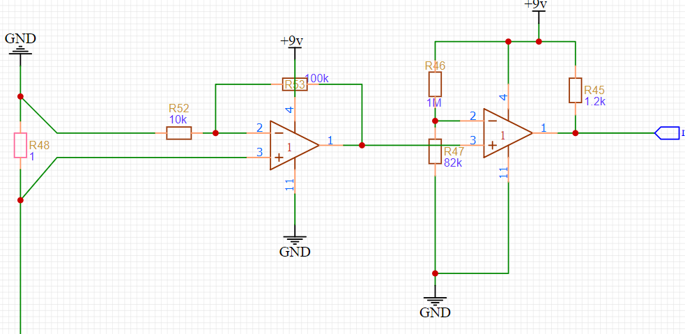
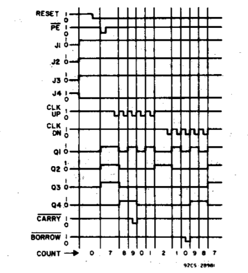
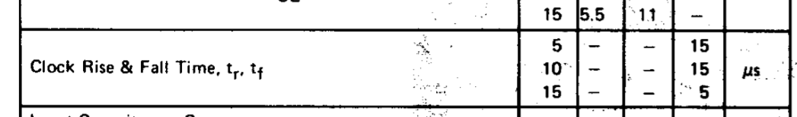

## 简易数字电源调试记录

### 前言
    这篇随笔主要记录这次设计的难点、遇到的问题、调试心得等。
****
### 最终效果展示

>本设计采用了线性稳压深度负反馈调压的方案，具有较高的负载调整率。达到满载和空载输出电压无明显变化。

### 设计难点

#### 难点一(按键电路设计)

>采用阻容滤波，参数选择方面一般看作完其他部分还会剩下哪些，然后大致搭配一下。

这是一个高位开关，阻容滤波

>>R40/R39=1/10，满足相关芯片时钟阈值电平即可（本设计中完全满足了cd4017时钟电平规定）

>>100k电阻配合0.1uF电容，上升沿在20ms级别（这样属于过盈设计，在洞洞板这样糟糕的硬件环境上求稳永远第一位，实测完全消除按键抖动。cd4017对时钟信号上升沿时间要求相对宽松，上升时间满足设计要求）

>>cd4017 时钟端输入阻抗较高，本设计采用100k电阻也是满足要求的。不过如果有10k左右电阻多余那就直接换，同样R39 50k——100k会更稳定。

>
最终的按键上升边沿波形，无抖动。上升时间大概20ms。

#### 难点二（cd40192时钟电路设计）

>采用反向施密特触发器对按键波形进行整形，然后为cd40192提供时钟。
>

>>采用LM393构成施密特触发器，上门限电压为2/3 VCC,下门限电压为1/3 VCC。输入端接按键输出信号。

>>如果没有10k电阻，其他电阻替代，注意分压电阻R43和R42不宜选取过大（容易耦合入噪声，造成致命问题，有条件可以R42电阻并联100nF或以上电容退偶）

>>LM393开漏输出，需要加上拉电阻R44

>
可以看到此示波器已经测不出上升沿时间了，可能在100ns级别。满足CD40192对时钟上升沿的要求。

#### 难点三（线性稳压）

>
采用深度负反馈稳定电压输出，电路结构为串联稳压电路。运放经过10欧姆电阻驱动两个并联三极管。

>>考虑到本设计中功率部分电流应力会比较大，因此采用三极管并联设计（满载要求达到120mA）。实测效果不错，可以长时间满载工作。未采用推挽结构，动态效果不佳，尽量避免驱动感性负载。

>>运放的驱动能力足够，不用考虑三极管达灵顿接法。另外采用深度负反馈，达到精准的电压输出效果。且具有较高的负载调整率。

#### 难点四（电流采样与比较）

>
采用正向放大然后电压比较方式。

>>根据设计要求选取合适的电阻参数。

>>有条件的话，建议在R47两端并上退偶电容（洞洞板的抗干扰能力太弱，很容易就会有噪声耦合到R47上，造成震荡等灾难性后果）。另外分压电阻不宜选用这么大，如果有选择，在10k左右可以接受。

>>有条件，这里的比较电路也设计成施密特触发电路，可以最大程度避免震荡的情况发生。

### 遇到的问题与排查和解决

### 问题一（比较器输出震荡问题）

>测试比较器功能时，用示波器观察到严重震荡现象

>>初步猜测可能为自激振动，自己的输出耦合到反相端。把相连的芯片卸下独立测试->发现此现象消失->装上cd4511->问题复现->确定与cd4511有关->研究发现当CD4511的BT脚悬空为未知状态时，出现震荡现象->基本确定由于由于BT引脚状态不定产生高频噪声耦合到比较器反相端引起震荡，从而维持震荡状态。

>>最有效的解决方法就是反向输入端并一个退偶电容，100nf以上，一般情况100nf最佳。

### 问题二（CD40192时钟问题）

>CD40192完全无法计数。

>>初步猜测可能是时序出问题，仔细对照时序表和实际测量时序，发现并没有问题

>>翻阅数据手册查阅CD40192工作条件->发现此器件对输入时钟上升沿有要求最大15us,而按键出来的上升沿有20ms。显然不符

>>用符合规定的时钟信号进行验证（555输出的时钟信号就符合）发现可以计数->着手设计波形整形电路。

第一个想到的是利用cd4011的与非门，结果如上图波形，虽然边沿变快了许多，20us左右，但是而外会有抖动，而且20us还是不符要求。pass
第二个是想用比较器做施密特触发器来解决抖动问题，采用同向输出设计方案。最终发现新的问题，时钟信号从建立到稳定会有一段时间高频震荡，怀疑输入阻抗匹配问题引起的，果断pass。最后采用反向输出施密特触发器，不用考虑输入阻抗问题，因为反向端口阻抗足够大，不会对按键信号造成干扰。完美解决时钟问题。下图为时钟边沿波形。

比较完美的上升波形，就是有点太快，有点过冲，不过不影响。

### 调试心得
>仿真的时候直接用的按键输出信号作为CD40192的计数时钟输入，是没有任何问题的。但是放到实际电路中就完全无法计数，说明仿真和实物之间是有一定差别的。不仅这个问题，在cd40192上，仿真用的器件模型与实际器件在时序上有点区别。也许是器件模型有点bug。此外，一切都好。

``return``